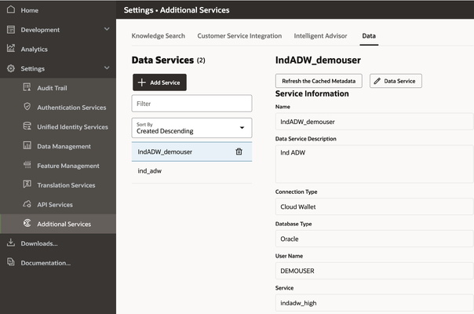
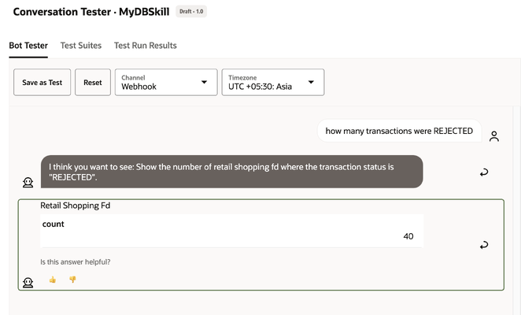

[](https://img.shields.io/badge/license-UPL-green)<!--[](https://sonarcloud.io/dashboard?id=oracle-devrel_database-chatbot-sql-dialog)-->

# How to build Database Chatbots with SQL Dialog Skills

Introduction: Retrieval Augmented generation (RAG) is a natural language processing (NLP) technique that combines information retrieval and natural language understanding with content generation. RAG is a framework that enhances Large Language Models (LLMs) by integrating external knowledge sources.

Most bots are trained on a finite number of intents, the customer's desired tasks or outcomes, and respond to those intents. RAG capabilities can improve current chatbots by allowing the AI system to provide natural language answers to questions that aren't on their intended list.

In this article, we will differentiate and classify various types of chatbots. We will see how to create AI and ML-based chatbots that can process natural language and interact with #OracleAutonomousDatabases. These chatbots with #OracleDigitalAssistant are super smart and can be game-changers. They can accept users' questions on chat, understand intent, and convert them into SQL statements and query databases to deliver the result in the web chatbot or mobile chatbot app or Oracle #APEX Application.

## Using RAG in Chat Applications

When a person wants an instant answer to a question, it's hard to beat the immediacy and usability of a chatbot. Most bots are trained on a finite number of intents--that is, the customer's desired tasks or outcomes--and they respond to those intents. RAG capabilities can make current bots better by allowing the AI system to provide natural language answers to questions that aren't in the intent list.

The "ask a question, get an answer" paradigm makes chatbots a perfect use case for generative AI, for many reasons. Questions often require specific context to generate an accurate answer, and given that chatbot users' expectations about relevance and accuracy are often high, it's clear how RAG techniques apply. In fact, for many organizations, chatbots may indeed be the starting point for RAG and generative AI use.

Now, Let us look at this from an angle of how chatbots work in general.

Typically, there are three kinds of chatbots.

**Type 1:** FAQ Chatbots: These chatbots work on frequently asked questions, which they are trained to answer based on intents and entities. For example,


    User1: I may have a claim to U.S. citizenship. Can I apply for a U.S. visa?

    Chatbot: <Intent: Apply for US Citizenship >
    Chatbot: <Response>
    With few exceptions, a person born in the United States acquires U.S. citizenship at birth. A state-issued birth certificate serves as evidence of citizenship. Review the Apply for a Passport webpage to learn more.


The same question can be asked as:


    User2: What is the process of applying for a US Visa?

    Chatbot: < Intent - US Visa Process >
    Here are some steps you can take to apply for a US visa:
    ... ...

These chatbots can easily answer the question correctly, or the question gets into "Unresolved intent", where the administrator can train the model to understand questions better and map it to intent. These chatbots are fairly static.

At this stage it is important to understand chat Intents, Unresolved Intents and Entities

Questions can vary. For example considering an online Retail store chatbot


    Chatbot user 1: I want to buy an OLED TV.
    Chatbot user 2: Show me the list of OLED TVs.
    Chatbot user 3: Which are the best OLED TVs to buy?

    All these point to a common intent

    "Buying OLED TV", which is a defined intent (defined by the chat administrator).

    Chatbot user 4: I am looking for a home entertainment system.

    This can be "Unresolved Intent", as the bot needs more information to process this chat.

Most often, Intents are mapped to Entities, as shown below.


    Size -> 42", 48", 55", 65", 77", 83"
    Brand -> Sony, Samsung, LGE, Xiaomi  ...
    Resolution -> 4K, 8K, ..
    Customer Ratings -> *, ***, *****

Bots can get into conversational mode to better understand the requirements.

**Type 2:** Conversational Chatbots: Let us take another use case from Banking or Financial Services. The example below shows how a chatbot can help customers block a credit card. Between the user and chatbot, there exists a flow or several flows, and each of these flows can call various services by using custom components.


    John Doe: < logs into chatbot on banking website >
    <System>: < invoke a custom component to get users's name >
    <System>: <Greet user>
    Chatbot: Hi John, How are you?

    John Doe: I am doing well. Can you help me block my credit card?
    <System>: <understand user's intent is to block card>
    Chatbot: Sure, John, please enter your registered mobile number.

    John Doe: my phone number is +91978001001010
    <System>: <custom component to verify registered mobile number>
    <System>: <custom component sends OTP to registered mobile number>
    Chatbot: please enter your OTP.

    John Doe: 12121212
    <System>: <custom component to verify OTP>
    <System>: <Check if the user has credit cards?>
    Chatbot: John, I can see you have two credit cards. Please enter the last four digits of your credit card.

    John Doe: 1111
    <System>: <custom component to verify last four digits>
    <flow>: <If OTP is Valid - block card>
    <flow>: <If OTP is Invalid - ask for credit card last four digits  again>
    Chatbot: Thanks, John; I have blocked your credit card ending 1111. Is there anything else I can help you?

    John Doe: No - Thanks.
    <flow>: <Close conversation with exit message>
    Chatbot: Have a great day, and leave your feedback on a scale of 1 to 10 (10 being most satisfied with this conversation)
    <System> : <Custom Component call to service that blocks card or service request is created to block the card.>

    John Doe: 10/10
    Chatbot: <exits conversation, window can be closed by the user>
    <System>: <log the ratings>
    <System>: <log the conversation>
    <flow>: <end conversation, close chat session>

These type of `<flows>` can be visually designed or the developer can write it in YAML script, below is a sample YAML flow designed for a Travel assistant chatbot that answers travel related FAQs

```yaml
main: true
name: TravelAppSkill
context:
  variables:
    # greeting is a variable that references the Greeting composite bag entity.
    # This composite bag entity has items to prompt for greeting type and name
    greeting: "Greeting"
    iResult: "nlpresult"
    searchWord: "string"
    cardsRangeStart: "int"

states:

  setCardsRangeStart:
    component: "System.SetVariable"
    properties:
      variable: "cardsRangeStart"
      value: 0
    transitions: {}

  intent:
    component: "System.Intent"
    properties:
      variable: "iResult"
    transitions:
      actions:
        unresolvedIntent: "cancelGreeting"
      next: "printGreeting"

  printGreeting:
    component: "System.CommonResponse"
    properties:
      # metadata property specifies the structure of the bot response message(s) that are sent to the user.
      metadata:
        responseItems:
          - type: "text"
            text: "Greetings. Allow me to introduce myself. I am Travel Guide Artie, a digital assistant."
    transitions:
      return: "done"


  cancelGreeting:
    component: "System.CommonResponse"
    properties:
      metadata:
        responseItems:
          - type: "text"
            text: "Sorry, I am still learning - \nplease contact us with your queries "
    transitions:
      return: "done"

  # A couple of necessary outputs
  finish:
    component: "System.CommonResponse"
    properties:
      processUserMessage: false
      metadata:
        responseItems:
        - type: "text"
          text: "Hope it was of help"
    transitions:
      return: "done"
```

**Type3:** AI-Driven Chatbots or RAG Chatbots: Ability to convert the user's question to an OMRQL and then to SQL commands, run it on the database tables, and show back the results in the chat window. This is where Natural Language Processing + AI chatbots emerge.


    John Doe: How many transactions have been Approved
    <OMRQL>: SELECT COUNT(*) FROM RetailShopping WHERE transaction_status = 'APPROVED'
    <SQL>: SELECT count(*) FROM RETAIL_SHOPPING WHERE TRANSACTION_STATUS = ? FETCH FIRST 100 ROWS ONLY
    Chatbot : Count 12

    John Doe: Show me the list of top 10 customers who purchased during our discount sale
    System : < NLP -> OMRQL -> SQL >
    Chatbot : <Shows Data>

    John Doe: Get me the list of top 10 customers for the year 2023
    System : < NLP -> OMRQL -> SQL >
    Chatbot : <Shows Data>

    John Doe: list the latest fraudulent transactions using our platinum card or gold card
    System : < NLP -> OMRQL -> SQL >
    Chatbot : <Show Data with Drill-Down to individual record>

## Assumptions & Requirements

1. Oracle Autonomous Database and Oracle Digital Assistant Instance are already provisioned on Oracle Cloud.
2. Download Oracle Digital Assistant Native Client SDK
3. A sample Database table with transaction data is created. [You can download this table from the code-assets folder][1].
4. Oracle APEX environment is available (This is Optional)


[1]: code-assets

Steps to get all these working together:

1. Login to Oracle Digital Assistant and Create Database Connection

    Log in to Oracle Digital Assistant. In the left navigation menu, select Settings -> Additional Services -> Data (Tab) -> Add Data Service.

    Establish Database connection using Autonomous Database Cloud Wallet and its corresponding password.

    

    You can also view this table from Oracle APEX or Autonomous Database SQL Web Developer

    


    

2. Create Skill and Entity

    From Oracle Digital Assistant Navigation Menu - Create Skill, Provide any name. However, the Dialog Mode should be Visual for this use case.

    

    Under Entities, Select the Tables that we want.

    

    The database table will now be listed under Entities.

    

3. Train the model

    Select Train in the top navigation and then select "A Linguistics-based model", later select "A Machine learning-based model". It will take some time for the training to be completed.

    

4. Test the model

    1. Click on the Preview icon in the top navigation and start testing the model and its generated SQL.

        ```console
        Chatbot User: How many transactions were rejected
        ```

        

        ```console
        Chatbot User: show me the total number of transactions
        ```

        

        ```console
        Chatbot User: list the latest transaction
        ```

        

        ```console
        Chatbot User: list the transactions with credit card no ---
        ```

        

        For every chatbot response, there will be an SQL Dialog where you can verify the OMRQL and corresponding SQL; the same queries can be tuned or changed if required while training the bot for more accuracy.

        

        

        Users can also drill down into individual records while a list of records is returned.

        

    2. Create a web channel for our Skill.

        Under left navigation -> Development -> Channels -> Add Channel and create Oracle Web channel. We would need this channel ID and Digital Assistant website URL later.

        

        Optionally, you can turn off client authentication.

    3. Configure chatbot SDK Javascript file

        [Download web client SDK][2]. Extract on your local system. Update settings.js and change the URI (matching the Digital Assistant URL on the web browser and channel ID; the user ID can be left blank.


        [2]: https://docs.oracle.com/en/cloud/paas/digital-assistant/sdks.html?trk=article-ssr-frontend-pulse_little-text-block

        

5. Run the web client

    We can now run the index.html web page as a stand-alone or Live Server of Visual Studio code. from here, we are all set to put the chatbot on any static website. CSS can be customised as required. all it needs is the following lines of HTML code

    ```html
    <link rel="stylesheet" href="./styles/redwood-base.css">
    <script src="scripts/settings.js" defer></script>
    <script src="scripts/web-sdk.js" onload="initSdk('Bots')" defer></script>
    ```

    ```console
    Chatbot User: show distinct top 10 customers based on transactions.
    ```

    

6. Run chat on Oracle APEX

    If you plan to run this chatbot on your APEX application, upload the settings.js, web-sdk.js and redwood-base.css into APEX application folder under shared components -> Static Application Files.

    Create APEX page and just create a static html region with following code, change the path if required.

    ```html
    <html lang="en-US" class="no-js" >
    <head>
        <script src="#APP_FILES#oda/settings#MIN#.js"></script>
        <script src="#APP_FILES#oda/web-sdk.js" onload="initSdk('Bots')"></script>
        <link rel="stylesheet" href="#APP_FILES#oda/redwood-base.css" >
    </head>
    </html>
    ```

    

    ```console
    Chatbot User: what is the total sum value of all transactions
    ```

    


## Contributing

This project welcomes contributions from the community. Before submitting a pull
request, please [review our contribution guide](./CONTRIBUTING.md).

## Security

Please consult the [security guide](./SECURITY.md) for our responsible security
vulnerability disclosure process.

## License

Copyright (c) 2024 Oracle and/or its affiliates.

Licensed under the Universal Permissive License (UPL), Version 1.0.

See [LICENSE](LICENSE.txt) for more details.

ORACLE AND ITS AFFILIATES DO NOT PROVIDE ANY WARRANTY WHATSOEVER, EXPRESS OR IMPLIED, FOR ANY SOFTWARE, MATERIAL OR CONTENT OF ANY KIND CONTAINED OR PRODUCED WITHIN THIS REPOSITORY, AND IN PARTICULAR SPECIFICALLY DISCLAIM ANY AND ALL IMPLIED WARRANTIES OF TITLE, NON-INFRINGEMENT, MERCHANTABILITY, AND FITNESS FOR A PARTICULAR PURPOSE.  FURTHERMORE, ORACLE AND ITS AFFILIATES DO NOT REPRESENT THAT ANY CUSTOMARY SECURITY REVIEW HAS BEEN PERFORMED WITH RESPECT TO ANY SOFTWARE, MATERIAL OR CONTENT CONTAINED OR PRODUCED WITHIN THIS REPOSITORY. IN ADDITION, AND WITHOUT LIMITING THE FOREGOING, THIRD PARTIES MAY HAVE POSTED SOFTWARE, MATERIAL OR CONTENT TO THIS REPOSITORY WITHOUT ANY REVIEW. USE AT YOUR OWN RISK.
# How to build Database Chatbots with SQL Dialog Skills

